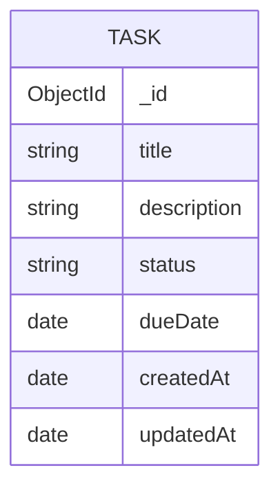

# Task Manager

A full-stack task management application built with React, Node.js, Express, TypeScript, and MongoDB. Users can create, update, complete, and delete tasks through a clean and responsive interface.


## Live Demo

**Frontend:** https://task-manager-lilac-pi-43.vercel.app

**Backend API:** https://task-manager-digi.onrender.com

## Screenshots

### Home Page


### Empty State


### Edit Task


## Features

- Create new tasks
- Edit existing tasks
- Delete tasks
- Mark tasks as pending or completed
- Set due dates
- RESTful API
- Interactive Swagger/OpenAPI documentation
- Responsive user interface
- Backend API testing with Jest and Supertest
- Automated CI with GitHub Actions

## Tech Stack

### Frontend

- React
- TypeScript
- Axios
- CSS

### Backend

- Node.js
- Express
- TypeScript
- Mongoose
- Swagger / OpenAPI

### Testing

- Jest
- Supertest
- MongoDB Memory Server

### Database

- MongoDB Atlas

### Deployment

- Vercel (Frontend)
- Render (Backend)

### CI

- GitHub Actions

## Project Structure

```text
task-manager/
├── .github/
│   └── workflows/
│       ├── backend-ci.yml
│       └── frontend-ci.yml
├── backend/
└── frontend/
```

## Architecture

```text
React Frontend
      │
      ▼
 Axios (HTTP)
      │
      ▼
Express REST API
      │
      ▼
   Mongoose
      │
      ▼
MongoDB Atlas
```
## Entity Relationship Diagram (ERD)



## Quick Start

### 1. Clone the repository

```bash
git clone https://github.com/hayderalhatemi/task-manager.git
cd task-manager
```

### 2. Backend

```bash
cd backend
npm install
npm run dev
```

### 3. Frontend

```bash
cd frontend
npm install
npm start
```

## API Documentation

Interactive Swagger/OpenAPI documentation:

- **Local:** http://localhost:5000/api-docs
- **Production:** https://task-manager-digi.onrender.com/api-docs

## Testing

### Backend

Automated API tests using Jest, Supertest, and an in-memory MongoDB instance (`mongodb-memory-server`).

Run the tests:

```bash
cd backend
npm test
```

Generate a coverage report:

```bash
npm test -- --coverage
```

Current test coverage includes:

- API health endpoint
- Create task
- Get all tasks
- Update task
- Delete task

## Environment Variables

### Backend (`backend/.env`)

```env
MONGO_URI=your_mongodb_connection_string
PORT=5000
```

### Frontend (`frontend/.env`)

```env
REACT_APP_API_URL=http://localhost:5000/api/tasks
```

## API Endpoints

| Method | Endpoint | Description |
|--------|----------|-------------|
| GET | `/api/tasks` | Get all tasks |
| POST | `/api/tasks` | Create a task |
| PUT | `/api/tasks/:id` | Update a task |
| DELETE | `/api/tasks/:id` | Delete a task |

## Roadmap

Future improvements planned for this project:

- [x] Full CRUD functionality
- [x] Responsive design
- [x] Backend deployment (Render)
- [x] Frontend deployment (Vercel)
- [x] Interactive Swagger/OpenAPI documentation
- [x] Backend testing (Jest + Supertest)
- [x] Backend CI with GitHub Actions
- [x] Frontend CI with GitHub Actions
- [ ] Frontend testing (React Testing Library)
- [ ] Task filtering
- [ ] Task search
- [ ] Dark mode
- [ ] Automatic deployment after CI

## Contributing

Contributions, suggestions, and feedback are welcome. Feel free to open an issue or submit a pull request.

## License

This project is licensed under the MIT License.