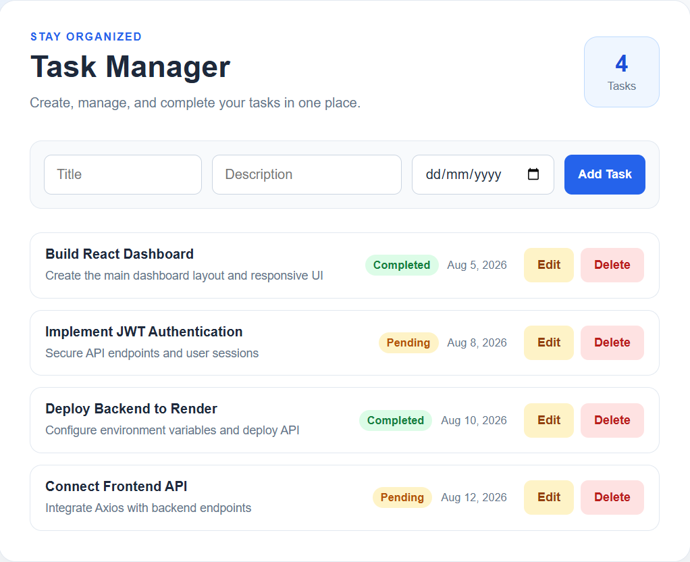
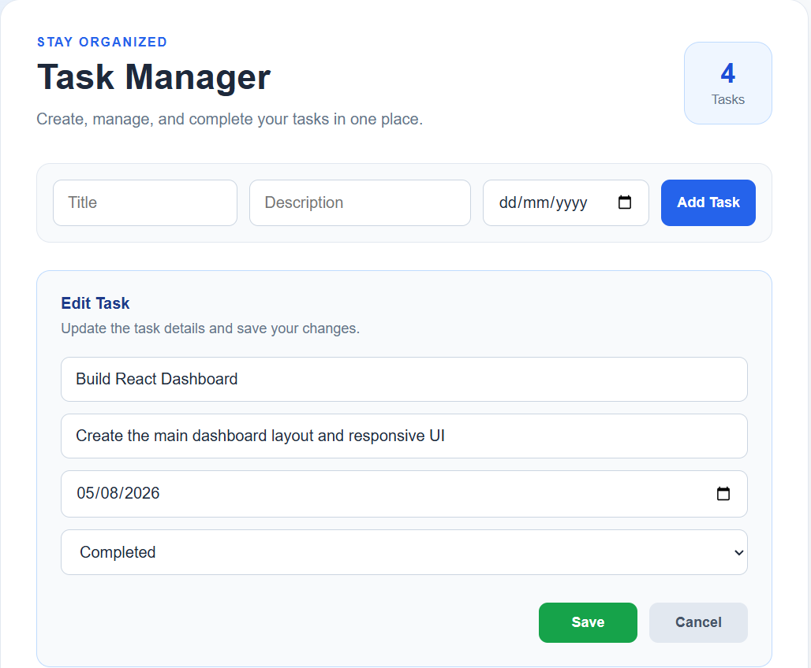
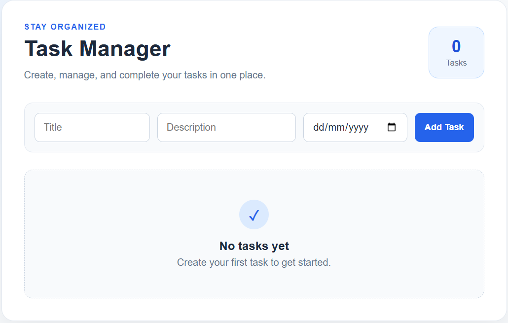

# Task Manager

A full-stack task management application built with React, Node.js, Express, TypeScript, and MongoDB. Users can create, update, complete, and delete tasks through a clean and responsive interface.

## Live Demo

**Frontend:** https://task-manager-lilac-pi-43.vercel.app

**Backend API:** https://task-manager-digi.onrender.com

## Screenshots

### Home Page


### Edit Task


### Empty State


## Features

- Create new tasks
- Edit existing tasks
- Delete tasks
- Mark tasks as pending or completed
- Set due dates
- RESTful API
- Responsive user interface

## Tech Stack

### Frontend
- React
- TypeScript
- Axios
- CSS

### Backend
- Node.js
- Express
- TypeScript
- Mongoose

### Database
- MongoDB Atlas

### Deployment
- Vercel (Frontend)
- Render (Backend)

## Project Structure

```text
task-manager/
├── backend/
└── frontend/
```

## Getting Started

### 1. Clone the repository

```bash
git clone https://github.com/hayderalhatemi/task-manager.git
cd task-manager
```

### 2. Backend

```bash
cd backend
npm install
npm run dev
```

### 3. Frontend

```bash
cd frontend
npm install
npm start
```

## Environment Variables

Create a `.env` file inside the `backend` folder:

```env
MONGO_URI=your_mongodb_connection_string
PORT=5000
```

## API Endpoints

| Method | Endpoint | Description |
|---------|----------|-------------|
| GET | `/api/tasks` | Get all tasks |
| POST | `/api/tasks` | Create a task |
| PUT | `/api/tasks/:id` | Update a task |
| DELETE | `/api/tasks/:id` | Delete a task |

## License

This project is open source and available under the MIT License.